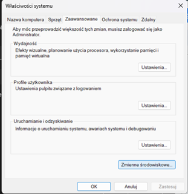

<h1>FormLink</h1>
<p>To use FormLink, you need to follow these steps:</p>
<ol>
  <li>Open the console window and run the command: <code>pip install pdfkit</code></li>
  <li>Download the wkhtmltopdf program from the website: <a href="https://wkhtmltopdf.org/downloads.html">https://wkhtmltopdf.org/downloads.html</a><br>
      </li>
  <li>Extract the downloaded file and install the program.</li>
  <li>In the bin folder, you will find configuration files needed for the application to work properly. To install the wkhtmltopdf program, copy the path of the bin folder and add it to the system environment variables on Windows:<br>
      </li>
  <li>In the Windows Settings search bar, type "Environment Variables":<br>
      </li>
  <li>Select the "Edit the system environment variables" option and click the "Environment Variables" button:<br>
      </li>
  <li>Under the "System variables" section, select the "Path" variable and click the "Edit" button:<br>
      </li>
  <li>Click the "New" button to add a new environment variable:<br>
      </li>
  <li>Enter the path you previously copied and click "OK" to save the changes:<br>
      </li>
  <li>Finally, in the views.py file, add the absolute path to the "wkhtmltopdf.exe" file on line 86:<br>
      </li>
</ol>
<h3>What is the Proxy Model in Django?</h3>
  <p>An inherited proxy model can have a few extra functionalities, methods, and different behaviors than the parent model as defined by the creator or programmer. This can be useful in situations like having multiple types of users inherited from the same User Model, defining new functions for the proxy (new inherited model) which are only meant to be used by the proxy (new inherited model), and so forth. New fields cannot be added to proxy models; the limitation of the proxy model is that you cannot have custom fields there.</p>
  <h3>Properties for creating a proxy model:</h3>
  <ul>
    <li>The proxy model can exactly inherit from one non-abstract model class.</li>
    <li>It cannot inherit from multiple non-abstract model classes as it cannot provide connections between rows in different tables in the database.</li>
    <li>It can inherit from any number of abstract class models.</li>
    <li>The proxy model can inherit from any number of Proxy models that have the same non-abstract parent class.</li>
  </ul>
  <h3>What can be done with proxy models in Django?</h3>
  <ul>
    <li>We can change the pythonic behavior of the model in such ways as changing the ordering, annotating the model with a different name than the parent, etc.</li>
    <li>We can have a proxy model with a customized query_set to get relevant data according to the model.</li>
    <li>We can have a variety of methods, properties, and functions that are unique to that model.</li>
    <li>We can create multiple types of users which inherit from your base user model and they all can log in, authenticate, and perform different functions.</li>
  </ul>
  
  <h3>How to create super user and casual users?</h3>
  <p>create a superuser who can log in to the app and can see the functionalities, for that we will create a superuser with the email (It should be noted that by default, the superuser is assigned the "PATIENT" type upon creation. If we want to change this, it should be done in the settings /admin/.):<code>python manage.py createsuperuser</code></p>

  <p>By moving to the Django shell in the terminal. Also, we can create multiple users of both types from the Django shell.</p>

from proxymodelapp.models import *
    user1 = Doctor.objects.create_user(
    email = "doctorone@gmail.com" , password = "password")
    user1.save()
    user2 = Doctor.objects.create_user(
    email = "doctortwo@gmail.com" , password = "password")
    user2.save()
    user3 = Patient.objects.create_user(
    email = "patientone@gmail.com" , password = "password")
    user3.save()
    user4 = Patient.objects.create_user(
    email = "patienttwo@gmail.com" , password = "password")
    user4.save() 

```ruby
require 'redcarpet'
markdown = Redcarpet.new("Hello World!")
puts markdown.to_html
```

  <h3>What functions are assigned to specific types of users?</h3>
  <ul>
    <li>Type 'DOCTOR'has access to all forms created by patients, it can only view the patient's first name and last name for each form, but cannot create, delete or edit them.</li>
    <li>Type 'PATIENT' creates forms, has access only to their own created objects, and can perform functions such as preview, delete, and edit on them.</li>
  </ul>
<p>That's it! You can now use FormLink to store and generate PDF files for each user, from your Django web application.</p>
